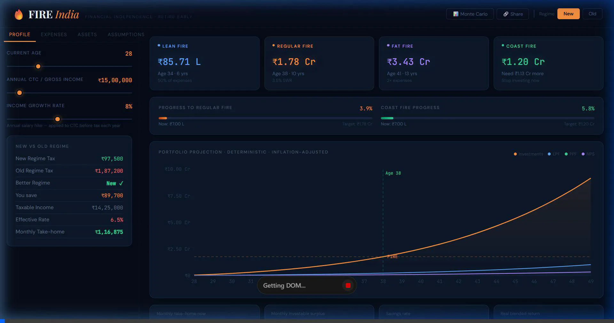

# FIRE India Calculator Analysis

## Overview
The `fire-calculator-india.jsx` file contains a comprehensive, single-file React component that calculates Financial Independence, Retire Early (FIRE) metrics specifically tailored for the Indian tax and investment context.

## Technical Architecture
- **Framework**: React (using `useState`, `useMemo`, `useCallback`)
- **Charting**: `recharts` (`ComposedChart`, `Area`, `XAxis`, `YAxis`, `Tooltip`, `ReferenceLine`, `ResponsiveContainer`)
- **Styling**: Vanilla CSS injected via a `<style>` tag and inline styles, avoiding external framework dependencies.

## Key Features & Business Logic

1. **Tax Engine (FY 2025-26)**
   - Supports both "New" and "Old" tax regimes.
   - Accurately calculates tax slabs, 87A rebate, surcharges, and the 4% cess.
   - Considers deductions under 80C, 80D, and 80CCD(1B) (NPS) for the old regime.
   - Includes marginal tax rate calculations.

2. **Projection Engine**
   - Projects portfolio growth annually up to age 65 (and 10 years post-FIRE).
   - Simulates income growth based on a user-defined hike rate.
   - Calculates contributions to tax-advantaged instruments: EPF, PPF, and NPS.
   - Automatically handles EMI payoffs and inflates healthcare premiums at 10% p.a.
   - Deducts Long-Term Capital Gains (LTCG) tax (12.5% above ₹1.25L) and debt taxes at slab rates.

3. **Monte Carlo Simulation**
   - Employs a Box-Muller transform for normal distribution (`randn`).
   - Runs 250 simulations to model equity (σ = ±17%) and debt (σ = ±3%) volatility.
   - Calculates a probabilistic FIRE success rate, showing 10th (bear), 50th (median), and 90th percentile bands.

4. **FIRE Variants Calculated**
   - **Regular FIRE**: Standard calculation based on the Safe Withdrawal Rate (SWR).
   - **Lean FIRE**: Covers 50% of targeted post-retirement expenses.
   - **Fat FIRE**: Covers 200% of targeted post-retirement expenses.
   - **Coast FIRE**: The current corpus needed to reach the FIRE number purely through compounding (without further contributions).

5. **State Management & Sharing**
   - State is stored in a structured `inputs` object.
   - Implements a Base64 URL-hash sharing mechanism (`loadInputs`, `share`), allowing users to share their specific assumptions via a simple link.

## Testing & Validation
I set up a Vite React environment and mounted the component. The application successfully renders and is fully functional:
- The UI is highly responsive, featuring a sleek, dark-mode aesthetic with vibrant accent colors (saffron, green, blue).
- Interactions across the **Profile**, **Expenses**, **Assets**, and **Assumptions** tabs instantly update the visual chart and summary statistics.
- Toggling the **Monte Carlo** simulation seamlessly overlays the p10-p90 confidence bands onto the area chart without blocking the main thread.
- No console errors or rendering glitches were observed during the testing phase.

## Conclusion
The codebase is very well-structured for a single-file application. It successfully isolates pure calculation logic (`calcTax`, `project`, `runMC`) from the UI rendering, leveraging `useMemo` effectively to prevent unnecessary recalculations of the 60-year projection arrays.

